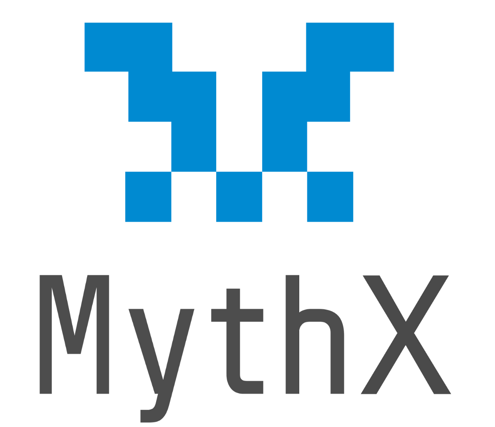
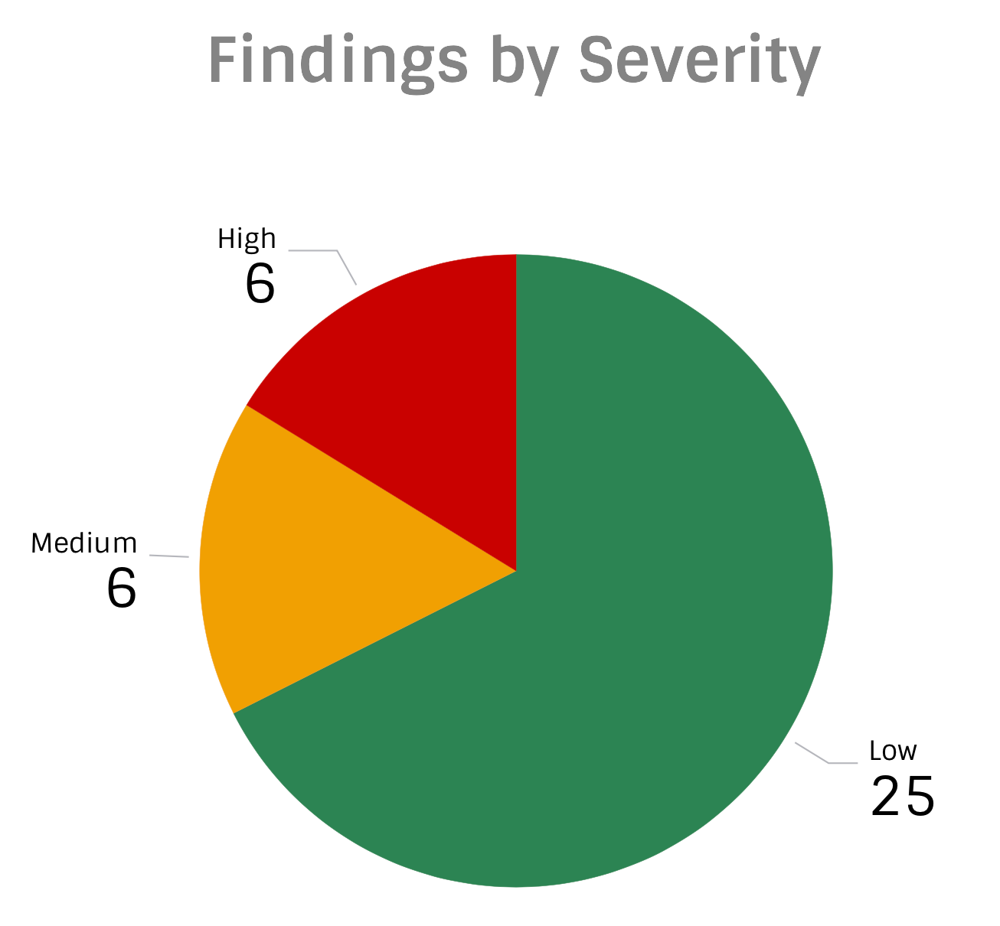

# MythX Security Testing Report - 0x Version 3



  * [Executive Summary](#executive-summary)
  * [MythX Pro Vulnerability Scan](#mythx-pro-vulnerability-scan)
    + [AssetProxy](#assetproxy)
    + [Coordinator](#coordinator)
    + [Dev Utils](#dev-utils)
    + [ERC721](#erc721)
    + [Exchange](#exchange)
    + [Staking](#staking)
    + [Utils](#utils)
  * [Fuzzing Campaign](#fuzzing-campaign)
  * [Verification of Custom Properties](#verification-of-custom-properties)

## Executive Summary

The [0x v3 codebase](https://github.com/0xProject/0x-monorepo/tree/90193c81978a486762f37ebde3983182ab17f6f9/) was tested using the [MythX](https://mythx.io) smart contract security service ahead of the release of 0x version 3. The scope of the project, which was performed alongside a manual security audit by [ConsenSys Diligence](https://diligence.consensys.net), was to detect generic security issues and best practice violations in the code. MythX Enterprise engagements also include a brief manual review by an auditor on the MythX team to eliminate spurious results. The engagement consisted of the following phases:

- Check each each smart contract individually for [generic bugs](https://mythx.io/swc-coverage) using the MythX Pro service;
- Execute greybox fuzzing campaigns on a live test environment;
- Check selected custom properties of the system using symbolic execution and fuzzing.

The CI setup and custom verifiers developed in this engagement can be re-used to continuosly check the security of the 0x code. Analysis was performed on [tree 90193c8](https://github.com/0xProject/0x-monorepo/tree/90193c81978a486762f37ebde3983182ab17f6f9/) in the 3.0 branch of the 0x monorepo.

### Results

MythX Pro detected a total of **37** potential issues. Most findings reflect suspected best practice violations such as variable names shadowing, ignoring failures of external calls and using `tx.origin` to determine the control flow. Most of the issues turned out to be expected behavior. However, a few potentially problematic issues such as integer overflows were discovered as well.

In addition the generic scan, we [checked correctness of the code](#verification-of-custom-properties) with respect to selected properties. While the 0x system passed most functional checks successfully, the proprietary fixed point signed integer library was shown to be [affected by integer arithmetic issues](#violations-found).

For additional details on the audit results and follow-up measures please refer to the audit reports published by ConsenSys Diligence:

- [0x v3 Exchange Audit](https://diligence.consensys.net/audits/2019/09/0x-v3-exchange/)
- [0x v3 Staking Audit](https://diligence.consensys.net/audits/2019/10/0x-v3-staking/)

### Recommendations

- Continuosly verify the code using MythX, including the custom verifiers built in this project, to prevent regressions and newly introduced security issues.

## MythX Pro Vulnerability Scan



### Findings Overview

With MythX Pro, each smart contract is compiled individually and checked for a range of security issues using static and dynamic analysis. The following table lists the bug classes that were tested for. A checkmark in the "pass" column indicates that no issues were detected in the category. An "X" indicates that one or more issues in the category were found.


| SWC ID  | Bug class                                | Pass |
|---------|------------------------------------------|------|
| [SWC-100](https://swcregistry.io/docs/SWC-100) | Function Default Visibility              |  &#x2714;  |
| [SWC-101](https://swcregistry.io/docs/SWC-101) | Integer Overflow and Underflow           |  &#x2716;|
| [SWC-102](https://swcregistry.io/docs/SWC-102) | Outdated Compiler Version                |  &#x2714;  |
| [SWC-103](https://swcregistry.io/docs/SWC-103) | Floating Pragma                          |  &#x2714;  |
| [SWC-104](https://swcregistry.io/docs/SWC-104) | Unchecked Call Return Value              |  &#x2714;  |
| [SWC-105](https://swcregistry.io/docs/SWC-105) | Unprotected Ether Withdrawal             |  &#x2716; |
| [SWC-106](https://swcregistry.io/docs/SWC-106) | Unprotected SELFDESTRUCT Instruction     |  &#x2714; |
| [SWC-107](https://swcregistry.io/docs/SWC-107) | Reentrancy                               |  &#x2714; |
| [SWC-108](https://swcregistry.io/docs/SWC-108) | State Variable Default Visibility        |  &#x2714; |
| [SWC-109](https://swcregistry.io/docs/SWC-109) | Uninitialized Storage Pointer            |  &#x2714; |
| [SWC-110](https://swcregistry.io/docs/SWC-110) | Assert Violation                         |  &#x2716;|
| [SWC-111](https://swcregistry.io/docs/SWC-111) | Use of Deprecated Solidity Functions     | &#x2714; |
| [SWC-112](https://swcregistry.io/docs/SWC-112) | Delegatecall to Untrusted Callee         | &#x2714;  |
| [SWC-113](https://swcregistry.io/docs/SWC-113) | DoS with Failed Call                     | &#x2714; |
| [SWC-114](https://swcregistry.io/docs/SWC-114) | Transaction Order Dependence             | &#x2714; |
| [SWC-115](https://swcregistry.io/docs/SWC-115) | Authorization through tx.origin          | &#x2716; |
| [SWC-116](https://swcregistry.io/docs/SWC-116) | Timestamp Dependence                     | &#x2716; |
| [SWC-118](https://swcregistry.io/docs/SWC-118) | Incorrect Constructor Name               | &#x2714;  |
| [SWC-119](https://swcregistry.io/docs/SWC-119)| Shadowing State Variables                 | &#x2716;  |
| [SWC-120](https://swcregistry.io/docs/SWC-120) | Weak Sources of Randomness               | &#x2714;  |
| [SWC-123](https://swcregistry.io/docs/SWC-123) | Requirement Violation                    | &#x2714;  |
| [SWC-124](https://swcregistry.io/docs/SWC-124) | Write to Arbitrary Storage Location      | &#x2714;  |
| [SWC-127](https://swcregistry.io/docs/SWC-127) | Arbitrary Jump                           | &#x2714;  |
| [SWC-128](https://swcregistry.io/docs/SWC-128) | Gas Exhaustion                           | &#x2714;  |
| [SWC-129](https://swcregistry.io/docs/SWC-129) | Typographical Error                      | &#x2714;  |
| [SWC-130](https://swcregistry.io/docs/SWC-130) | Right-To-Left-Override control character | &#x2714;  |

### AssetProxy

**asset-proxy/contracts/src/ERC20BridgeProxy.sol**

| Severity | Line | Description | SWC |
| --- | --- | --- | --- |
| ```Low``` | [105:49](https://github.com/0xProject/0x-monorepo/blob/90193c81978a486762f37ebde3983182ab17f6f9/contracts/asset-proxy/contracts/src/ERC20BridgeProxy.sol#L105) | **Local variable shadows a state variable.** The local variable `owner` in contract `ERC20BridgeProxy` shadows the state variable with the same name `owner` in contract `Ownable`. | [SWC-119](https://smartcontractsecurity.github.io/SWC-registry/docs/SWC-119) |
| ```Low``` | [119:45](https://github.com/0xProject/0x-monorepo/blob/90193c81978a486762f37ebde3983182ab17f6f9/contracts/asset-proxy/contracts/src/ERC20BridgeProxy.sol#L119) | **Local variable shadows a state variable.** The local variable `owner` in contract `ERC20BridgeProxy` shadows the state variable with the same name `owner` in contract `Ownable`. | [SWC-119](https://smartcontractsecurity.github.io/SWC-registry/docs/SWC-119) |

### Coordinator

**coordinator/contracts/src/MixinCoordinatorApprovalVerifier.sol**

| Severity | Line | Description | SWC |
| --- | --- | --- | --- |
| ```Medium``` | [147:12](https://github.com/0xProject/0x-monorepo/blob/90193c81978a486762f37ebde3983182ab17f6f9/contracts/coordinator/contracts/src/MixinCoordinatorApprovalVerifier.sol#L147) | **Use of tx.origin as a part of authorization control.** Using `tx.origin` as a security control can lead to authorization bypass vulnerabilities. Accessing the origin information has been discovered in a conditional statement. It is recommended to use `msg.sender` instead.| [SWC-115](https://smartcontractsecurity.github.io/SWC-registry/docs/SWC-115) |
| ```Medium``` | [175:65](https://github.com/0xProject/0x-monorepo/blob/90193c81978a486762f37ebde3983182ab17f6f9/contracts/coordinator/contracts/src/MixinCoordinatorApprovalVerifier.sol#L175) | **Use of tx.origin as a part of authorization control.** Using `tx.origin` as a security control can lead to authorization bypass vulnerabilities. Consider using `msg.sender` unless you really know what you are doing. | [SWC-115](https://smartcontractsecurity.github.io/SWC-registry/docs/SWC-115) |

### Dev Utils

**dev-utils/contracts/src/LibAssetData.sol**

| Severity | Line | Description | SWC |
| --- | --- | --- | --- |
| ```Low``` | [39:4](https://github.com/0xProject/0x-monorepo/blob/90193c81978a486762f37ebde3983182ab17f6f9/contracts/dev-utils/contracts/src/LibAssetData.sol#L39) | **State variable shadows another state variable.** The state variable `_EXCHANGE` in contract `LibAssetData` shadows another state variable with the same name `_EXCHANGE` in contract `OrderTransferSimulationUtils`. | [SWC-119](https://smartcontractsecurity.github.io/SWC-registry/docs/SWC-119) |

**dev-utils/contracts/src/OrderTransferSimulationUtils.sol**

| Severity | Line | Description | SWC |
| --- | --- | --- | --- |
| ```Low``` | [154:16](https://github.com/0xProject/0x-monorepo/blob/90193c81978a486762f37ebde3983182ab17f6f9/contracts/dev-utils/contracts/src/OrderTransferSimulationUtils.sol#L154) | **It is possible to trigger an exception (opcode 0xfe)**. Exceptions can be caused by type errors, division by zero, out-of-bounds array access, or assert violations. Note that explicit assert() should only be used to check invariants. Use require() for regular input checking.<br><br>**Review:** The exception is caused by out-of-bounds array access. | [SWC-110](https://smartcontractsecurity.github.io/SWC-registry/docs/SWC-110) |

### ERC721

**erc721/contracts/src/ERC721Token.sol**

| Severity | Line | Description | SWC |
| --- | --- | --- | --- |
| ```Low``` | [136:8](https://github.com/0xProject/0x-monorepo/blob/90193c81978a486762f37ebde3983182ab17f6f9/contracts/erc721/contracts/src/ERC721Token.sol#L136) | **Local variable shadows a state variable.** The local variable `owner` in contract `ERC721Token` shadows the state variable with the same name `owner` in contract `Ownable`. | [SWC-119](https://smartcontractsecurity.github.io/SWC-registry/docs/SWC-119) |
| ```Low``` | [206:8](https://github.com/0xProject/0x-monorepo/blob/90193c81978a486762f37ebde3983182ab17f6f9/contracts/erc721/contracts/src/ERC721Token.sol#L206) | **Local variable shadows a state variable.** The local variable `owner` in contract `ERC721Token` shadows the state variable with the same name `owner` in contract `Ownable`. | [SWC-119](https://smartcontractsecurity.github.io/SWC-registry/docs/SWC-119) |
| ```Low``` | [246:8](https://github.com/0xProject/0x-monorepo/blob/90193c81978a486762f37ebde3983182ab17f6f9/contracts/erc721/contracts/src/ERC721Token.sol#L246) | **Local variable shadows a state variable.** The local variable `owner` in contract `ERC721Token` shadows the state variable with the same name `owner` in contract `Ownable`. | [SWC-119](https://smartcontractsecurity.github.io/SWC-registry/docs/SWC-119) |

**erc721/contracts/src/MintableERC721Token.sol**

| Severity | Line | Description | SWC |
| --- | --- | --- | --- |
| ```Low``` | [39:8](https://github.com/0xProject/0x-monorepo/blob/90193c81978a486762f37ebde3983182ab17f6f9/contracts/erc721/contracts/src/MintableERC721Token.sol#L39) | **Local variable shadows a state variable.** The local variable `owner` in contract `MintableERC721Token` shadows the state variable with the same name `owner` in contract `Ownable`. | [SWC-119](https://smartcontractsecurity.github.io/SWC-registry/docs/SWC-119) |
| ```Low``` | [67:8](https://github.com/0xProject/0x-monorepo/blob/90193c81978a486762f37ebde3983182ab17f6f9/contracts/erc721/contracts/src/MintableERC721Token.sol#L67) | **Local variable shadows a state variable.** The local variable `owner` in contract `MintableERC721Token` shadows the state variable with the same name `owner` in contract `Ownable`. | [SWC-119](https://smartcontractsecurity.github.io/SWC-registry/docs/SWC-119) |

### Exchange

**exchange/contracts/src/MixinSignatureValidator.sol**

| Severity | Line | Description | SWC |
| --- | --- | --- | --- |
| ```Low``` | [375:15](https://github.com/0xProject/0x-monorepo/blob/90193c81978a486762f37ebde3983182ab17f6f9/contracts/exchange/contracts/src/MixinSignatureValidator.sol#L375) |  **It is possible to trigger an exception (opcode 0xfe)**. Exceptions can be caused by type errors, division by zero, out-of-bounds array access, or assert violations. Note that explicit assert() should only be used to check invariants. Use require() for regular input checking.<br><br>**Review:** The exception is caused by accessing a non-existant enum element in `SignatureType`. | [SWC-110](https://smartcontractsecurity.github.io/SWC-registry/docs/SWC-110) |

**exchange/contracts/src/MixinProtocolFees.sol**

| Severity | Line | Description | SWC |
| --- | --- | --- | --- |
| ```Medium``` | [166:53](https://github.com/0xProject/0x-monorepo/blob/90193c81978a486762f37ebde3983182ab17f6f9/contracts/exchange/contracts/src/MixinProtocolFees.sol#L166) | **Multiple external calls in the same transaction.** Multiple calls to external contracts were made. To prevent DoS, avoid multiple external calls or make sure all callees can be trusted.<br><br>**Review:** This issue refers to batched calls to `_payProtocolFeeToFeeCollector`, for instance in the function [_payTwoProtocolFees](https://github.com/0xProject/0x-monorepo/blob/90193c81978a486762f37ebde3983182ab17f6f9/contracts/exchange/contracts/src/MixinProtocolFees.sol#L95). Note that if any of the protocol fee transactions fails, the transaction will revert and subsequent payouts will fail to execute as well. This may not be a security issue in practice (i.e. a maker has nothing to gain by "blocking" the protocol fee payout), but should be reviewed nevertheless.

**exchange/contracts/src/MixinTransactions.sol**

| Severity | Line | Description | SWC |
| --- | --- | --- | --- |
| ```Low``` | [78:65](https://github.com/0xProject/0x-monorepo/blob/90193c81978a486762f37ebde3983182ab17f6f9/contracts/exchange/contracts/src/MixinTransactions.sol#L78) | **It is possible to trigger an exception (opcode 0xfe)**. Exceptions can be caused by type errors, division by zero, out-of-bounds array access, or assert violations. Note that explicit assert() should only be used to check invariants. Use require() for regular input checking.<br><br>**Review:** The exception is caused by out-of-bounds array access. | [SWC-110](https://smartcontractsecurity.github.io/SWC-registry/docs/SWC-110) |

**exchange/contracts/src/MixinTransferSimulator.sol**

| Severity | Line | Description | SWC |
| --- | --- | --- | --- |
| ```Low``` | [53:16](https://github.com/0xProject/0x-monorepo/blob/90193c81978a486762f37ebde3983182ab17f6f9/contracts/exchange/contracts/src/MixinTransferSimulator.sol#L53) [54:16](https://github.com/0xProject/0x-monorepo/blob/90193c81978a486762f37ebde3983182ab17f6f9/contracts/exchange/contracts/src/MixinTransferSimulator.sol#L54) [55:16](https://github.com/0xProject/0x-monorepo/blob/90193c81978a486762f37ebde3983182ab17f6f9/contracts/exchange/contracts/src/MixinTransferSimulator.sol#L55)| **It is possible to trigger an exception (opcode 0xfe)**. Exceptions can be caused by type errors, division by zero, out-of-bounds array access, or assert violations. Note that explicit assert() should only be used to check invariants. Use require() for regular input checking.<br><br>**Review:** The exceptions are caused by out-of-bounds array access. | [SWC-110](https://smartcontractsecurity.github.io/SWC-registry/docs/SWC-110) |

**exchange/contracts/src/MixinWrapperFunctions.sol**

| Severity | Line | Description | SWC |
| --- | --- | --- | --- |
| ```Low``` | [108:16](https://github.com/0xProject/0x-monorepo/blob/90193c81978a486762f37ebde3983182ab17f6f9/contracts/exchange/contracts/src/MixinWrapperFunctions.sol#L108) [109:16](https://github.com/0xProject/0x-monorepo/blob/90193c81978a486762f37ebde3983182ab17f6f9/contracts/exchange/contracts/src/MixinWrapperFunctions.sol#L109) [169:16](https://github.com/0xProject/0x-monorepo/blob/90193c81978a486762f37ebde3983182ab17f6f9/contracts/exchange/contracts/src/MixinWrapperFunctions.sol#L169) [218:16](https://github.com/0xProject/0x-monorepo/blob/90193c81978a486762f37ebde3983182ab17f6f9/contracts/exchange/contracts/src/MixinWrapperFunctions.sol#L218)  | **It is possible to trigger an exception (opcode 0xfe)**. Exceptions can be caused by type errors, division by zero, out-of-bounds array access, or assert violations. Note that explicit assert() should only be used to check invariants. Use require() for regular input checking.<br><br>**Review:** The exceptions are caused by out-of-bounds array access.  | [SWC-110](https://smartcontractsecurity.github.io/SWC-registry/docs/SWC-110) |
| ```Low``` | [344:53](https://github.com/0xProject/0x-monorepo/blob/90193c81978a486762f37ebde3983182ab17f6f9/contracts/exchange/contracts/src/MixinWrapperFunctions.sol#L344) | **Unpropagated call failure.** A failed call did not result in a failure of the caller. Make sure your exception handling is correctly implemented. <br><br>**Review**: This issue refers to the fact that `_fillOrderNoThrow` does not throw (as the name implies) if the `delegatecall` in [line 344](https://github.com/0xProject/0x-monorepo/blob/90193c81978a486762f37ebde3983182ab17f6f9/contracts/exchange/contracts/src/MixinWrapperFunctions.sol#L344) fails. This is however expected behaviour. | [SWC-104](https://smartcontractsecurity.github.io/SWC-registry/docs/SWC-104) |

**exchange/contracts/src/libs/LibExchangeRichErrorDecoder.sol**

| Severity | Line | Description | SWC |
| --- | --- | --- | --- |
| ```Low``` | [51:20](https://github.com/0xProject/0x-monorepo/blob/90193c81978a486762f37ebde3983182ab17f6f9/contracts/exchange/contracts/src/libs/LibExchangeRichErrorDecoder.sol#L51) [136:22](https://github.com/0xProject/0x-monorepo/blob/90193c81978a486762f37ebde3983182ab17f6f9/contracts/exchange/contracts/src/libs/LibExchangeRichErrorDecoder.sol#L136) [180:20](https://github.com/0xProject/0x-monorepo/blob/90193c81978a486762f37ebde3983182ab17f6f9/contracts/exchange/contracts/src/libs/LibExchangeRichErrorDecoder.sol#L180) [241:20](https://github.com/0xProject/0x-monorepo/blob/90193c81978a486762f37ebde3983182ab17f6f9/contracts/exchange/contracts/src/libs/LibExchangeRichErrorDecoder.sol#L241) [302:20](https://github.com/0xProject/0x-monorepo/blob/90193c81978a486762f37ebde3983182ab17f6f9/contracts/exchange/contracts/src/libs/LibExchangeRichErrorDecoder.sol#L302) [342:20](https://github.com/0xProject/0x-monorepo/blob/90193c81978a486762f37ebde3983182ab17f6f9/contracts/exchange/contracts/src/libs/LibExchangeRichErrorDecoder.sol#L342) | **It is possible to trigger an exception (opcode 0xfe)**. Exceptions can be caused by type errors, division by zero, out-of-bounds array access, or assert violations. Note that explicit assert() should only be used to check invariants. Use require() for regular input checking.<br><br>**Review:** The exceptions are caused by accessing non-existant enum fields in `LibOrder.OrderStatus` and ` LibExchangeRichErrors.SignatureErrorCodes`.| [SWC-110](https://smartcontractsecurity.github.io/SWC-registry/docs/SWC-110) |

### Staking

**staking/contracts/src/libs/Lib\.sol**

| Severity | Line | Description | SWC |
| --- | --- | --- | --- |
| ```Medium``` | [78:27](https://github.com/0xProject/0x-monorepo/blob/90193c81978a486762f37ebde3983182ab17f6f9/contracts/staking/contracts/src/libs/LibProxy.sol#L78) | **Unpropagated call failure.** A failed call did not result in a failure of the caller. Make sure your exception handling is correctly implemented.<br><br>**Review**: Call failures are not propagated if `revertRule` is set to `NEVER_REVERT`. This is expected behaviour. | [SWC-104](https://smartcontractsecurity.github.io/SWC-registry/docs/SWC-104) |
| ```Medium``` | [78:27](https://github.com/0xProject/0x-monorepo/blob/90193c81978a486762f37ebde3983182ab17f6f9/contracts/staking/contracts/src/libs/LibProxy.sol#L78) | **The return value of a message call is not checked.** External calls return a boolean value. If the callee contract halts with an exception, &#39;false&#39; is returned and execution continues in the caller. It is usually recommended to wrap external calls into a require statement to prevent unexpected states.<br><br>**Review**: When `revertRule` is set to `NEVER_REVERT` or `ALWAYS_REVERT` the return value of the call is ignored. This is expected behaviour.| [SWC-104](https://smartcontractsecurity.github.io/SWC-registry/docs/SWC-104) |

**staking/contracts/src/sys/MixinScheduler.sol**

| Type | Line | Description | SWC |
| --- | --- | --- | --- |
| ``Medium`` | [70:8](https://github.com/0xProject/0x-monorepo/blob/90193c81978a486762f37ebde3983182ab17f6f9/contracts/staking/contracts/src/sys/MixinScheduler.sol#L70) | **A control flow decision is made based on a predictable \.** The `block.timestamp` environment variable is used in to determine a control flow decision. Note that the values of variables like coinbase, gaslimit, block number and timestamp are predictable and can be manipulated by a malicious miner. Also keep in mind that attackers know hashes of earlier blocks. Don&#39;t use any of those environment variables for random number generation or to make critical control flow decisions.<br><br>**Review**:  Miners could indeed set the timestamp arbitrarily if there are large enough incentives to do so, it should be assessed whether this risk is acceptable. | [SWC-116](https://smartcontractsecurity.github.io/SWC-registry/docs/SWC-116) |

### Utils

**utils/contracts/src/LibBytes.sol**

| Severity | Line | Description | SWC |
| --- | --- | --- | --- |
| ```High``` | [304:23](https://github.com/0xProject/0x-monorepo/blob/90193c81978a486762f37ebde3983182ab17f6f9/contracts/utils/contracts/src/LibBytes.sol#L304) [339:23](https://github.com/0xProject/0x-monorepo/blob/90193c81978a486762f37ebde3983182ab17f6f9/contracts/utils/contracts/src/LibBytes.sol#L339) [388:23](https://github.com/0xProject/0x-monorepo/blob/90193c81978a486762f37ebde3983182ab17f6f9/contracts/utils/contracts/src/LibBytes.sol#L388) [418:23](https://github.com/0xProject/0x-monorepo/blob/90193c81978a486762f37ebde3983182ab17f6f9/contracts/utils/contracts/src/LibBytes.sol#L418) [478:23](https://github.com/0xProject/0x-monorepo/blob/90193c81978a486762f37ebde3983182ab17f6f9/contracts/utils/contracts/src/LibBytes.sol#L478) | **The binary addition can overflow.** The operands of the addition operation are not sufficiently constrained. The addition could therefore result in an integer overflow. Prevent the overflow by checking inputs or ensure sure that the overflow is caught by an assertion.<br><br>**Review**: This might indeed cause issues depending on the context in which `libBytes` is used. For a detailed analysis refer to the Diligence audit report. | [SWC-101](https://smartcontractsecurity.github.io/SWC-registry/docs/SWC-101) |

**utils/contracts/src/Refundable.sol**

| Severity | Line | Description | SWC |
| --- | --- | --- | --- |
| ```High``` | [66:12](https://github.com/0xProject/0x-monorepo/blob/90193c81978a486762f37ebde3983182ab17f6f9/contracts/utils/contracts/src/Refundable.sol#L66) | **Anyone can withdraw ETH from the contract account.** Arbitrary senders other than the contract creator can withdraw ETH from the contract account without previously having sent an equivalent amount of ETH to it. This is likely to be a vulnerability.<br><br>**Review**: The MythX symbolic execution engine warns if it detects a state where a large amount of ETH can be extracted by an arbitrary actor. In this case this could happen in theory - but only if ETH is force-sent to the contract, e.g. using `selfdestruct`. In practice, there is no security issue assuming that the refund logic always works correctly (i.e. it is never the case that ETH remains in the contract that is then refunded to another user). We implemented a custom check to verify this (see below). | [SWC-105](https://smartcontractsecurity.github.io/SWC-registry/docs/SWC-105) |

## Fuzzing Campaign

In addition to the MythX Pro check we executed multiple long-running fuzzing campaigns (6h) using the [Harvey greybox
fuzzer](https://arxiv.org/abs/1905.06944) **on each of the 20
migrated/deployed contracts** for changeset 96c8da9. We created a custom setup that
deploys all contracts to a Ganache node and then uses the deployed state as the initial
state for fuzzing campaigns. This enables much more elaborate fuzzing since contracts and
all their dependencies are analyzed. In total, Harvey discovered **149 issues** consisting
of (see pie chart below for an overview):

- *SWC-101* (Integer Overflow and Underflow): 68
- *SWC-104* (Unchecked Call Return Value): 5
- *SWC-107* (Reentrancy): 6
- *SWC-110* (Assert Violation): 37
- *SWC-113* (DoS with Failed Call): 11
- *SWC-123* (Requirement Violation): 22
- *SWC-124* (Write to Arbitrary Storage Location): 0
- *SWC-127* (Arbitrary Jump with Function Type Variable): 0


We observed that the fuzzer keeps finding new issues over time (see bar chart below). In
particular, only **ca. 65% of the issues are detected within the first 30 minutes**
(current time limit for [MythX full mode](https://mythx.io/plans)). This highlights the
usefulness of long-running custom fuzzing campaigns.


### Review of Fuzzing Results

We reviewed a subset of the issues manually, in particular the issues most likely to cause security risks (re-entrancy and improper handling of external calls). The review did not uncover vulnerabilities. Many potential issues are mitigated because all called contracts are trusted.

For instance, the developers intentionally ignored return values in `OrderTransferSimulationUtils.sol` (line 117):

```
(, bytes memory returnData) = address(_EXCHANGE).call(simulateDispatchTransferFromCallsData);
```

In `LibAssetData.sol` (line 82) the return value is not ignored, but the transaction is not reverted if the call failed:

```
(bool success, bytes memory returnData) = tokenAddress.staticcall(balanceOfData);
balance = success && returnData.length == 32 ? returnData.readUint256(0) : 0;
```

For issues of type SWC-107 and SWC-113, the suspicious external calls were invoking other
0x contracts (e.g., the WETH token or the exchange). For instance, in
`MixinForwarderCore.sol` there is an external call to the WETH token on line 82.

Note that no full review of the results was performed due to time constraints - the [raw results are included in this repository](https://github.com/ConsenSys/0x-v3-mythx-report/tree/master/raw_results/harvey).

## Verification of Custom Properties

We created three custom checks for the following properties based on the specifications provided by 0x. The following techniques were used:

- Inserting runtime checks into the bytecode; For instance, to check a postcondition at the end of function calls. Search for counter-examples using  greybox fuzzing and symbolic execution.
- Developing custom callback modules to check properties using symbolic execution and SMT solving.

| Property | High-level Description | Result |
| --- | --- | --- |
| Exchange Payment | Verify that the contract account balance is zero ether at the end of a transaction. | &#x2714; |
| Asset Transfers triggered by unauthorized sender | Verify that successful asset transfers always originate from an authorized sender. | &#x2714; |
| Filling Closed Orders | Verify that only open orders can be filled.| &#x2714; |
| Fixed-point Integer Arithmetics | Arithmetic operations on fixed-point signed integers don't overflow. | &#x2716; |
| Asset Proxy | Actors cannot execute proxy calls unless they are explicitly listed in the `authorities` array by the owner. | &#x2714; |

### Violations found

The [verifier](code/VerifyFixedMath.sol) we built for `LibFixedMath` outputs three instances of integer underflows:

```
_add(0x800000000000000000000000000000000000000000000000000000000000000, 0x800000000000000000000000000000000000000000000000000000000000000)

_mul(0x800000000000000000000000000000000000000000000000000000000000000, 0xffffffffffffffffffffffffffffffffffffffffffffffffffffffffffffffff)

_div(0xffffffffffffffffffffffffffffffff00000000000000000000000000000000, 0xffffffffffffffffffffffffffffffffffffffffffffffffffffffffffffffff)
```

To reproduce run the following code:

```
pragma solidity ^0.5.0;

import "./LibFixedMath.sol";

contract FixedMathIntegerBugs {

    function underflow_add() public pure returns (int256)  {
        return LibFixedMath._add(
            -57896044618658097711785492504343953926634992332820282019728792003956564819968,
            -57896044618658097711785492504343953926634992332820282019728792003956564819968
        );
        // Returns 0
    }
    
    function underflow_mul() public pure returns (int256) {
        return LibFixedMath._mul(
            -1,
            -57896044618658097711785492504343953926634992332820282019728792003956564819968
        );
        // Returns -340282366920938463463374607431768211456
    }
    
    function underflow_div()  public pure returns (int256) {
        return LibFixedMath._div(
            -340282366920938463463374607431768211456, 
            -1
        );
        // Returns -57896044618658097711785492504343953926634992332820282019728792003956564819968 (-2**256)
    }
}
```

The code behaved correctly with respect to the other properties tested.

In addition to the checks listed above, we created custom checks for a more specific property based on an issue
discovered by the audit team. It checks complex state invariants for the `MixinStorage`
contract. We will be able to automatically check the property once the staking contracts
are part of the migrated contracts.
